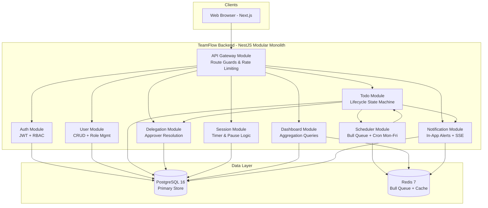
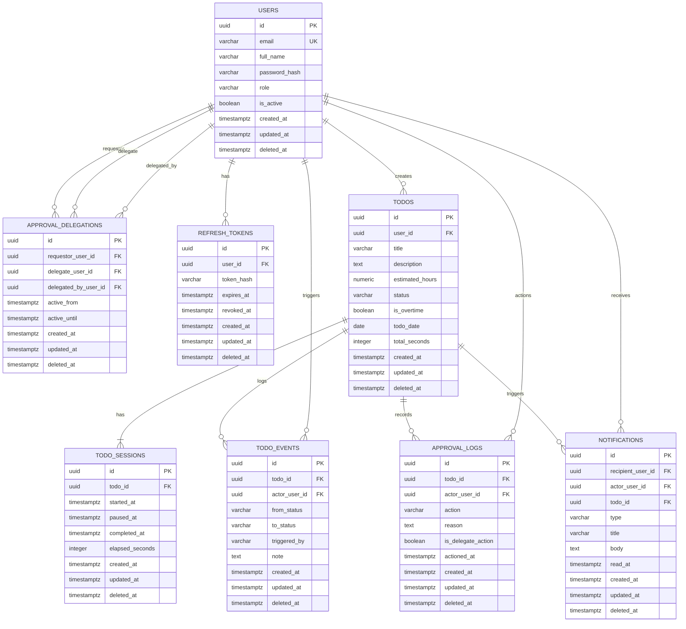
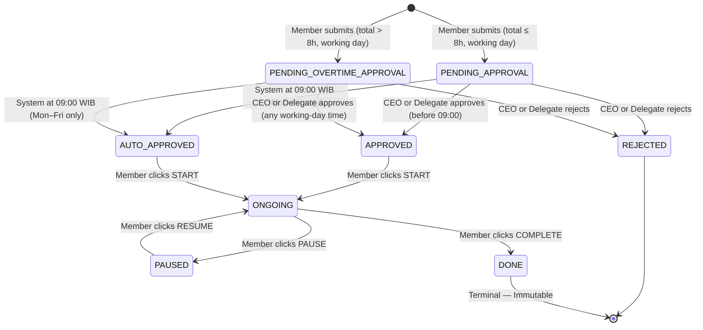
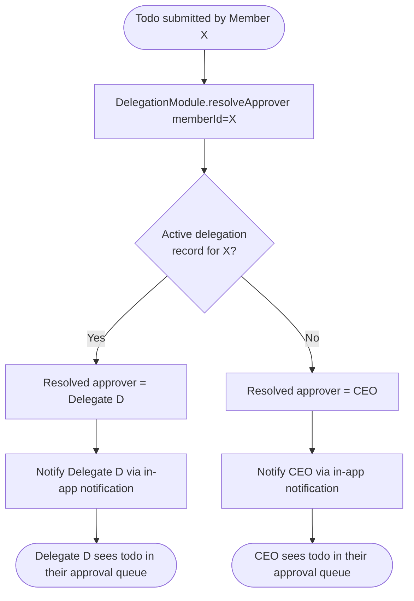

# Software Requirements Specification (SRS)
# TeamFlow — Team Todo Management System

**Document Version:** 1.1  
**Status:** Draft — Updated with Stakeholder Clarifications  
**Prepared by:** AI Software Architect (iSAQB CPSA-A aligned)  
**Date:** 8 June 2026  
**Standard:** iSAQB CPSA-A / ISO/IEC 29148:2018  

### Changelog

| Version | Date | Author | Changes |
|---|---|---|---|
| 1.0 | 8 Jun 2026 | AI Architect | Initial SRS draft |
| 1.1 | 8 Jun 2026 | AI Architect | Added: Approval Delegation per requestor; Weekend exclusion from working days; DONE todos are immutable & hidden by default; In-app notification only (no email/WA); New entities: `approval_delegations`; Updated ERD & DDL; New FR-020–FR-023; New ADR-006 |

---

## Table of Contents

1. [Introduction](#1-introduction)
2. [System Overview](#2-system-overview)
3. [Architecture Overview](#3-architecture-overview-isaqb-cpsa-a-aligned)
4. [Functional Requirements](#4-functional-requirements)
5. [Non-Functional Requirements & Quality Attributes](#5-non-functional-requirements--quality-attributes)
6. [System Interfaces & API Contracts](#6-system-interfaces--api-contracts)
7. [Data Architecture & Database Design](#7-data-architecture--database-design)
8. [Security Architecture](#8-security-architecture)
9. [Deployment Architecture](#9-deployment-architecture)
10. [Risks & Mitigation](#10-risks--mitigation)
11. [ERD — Entity Relationship Diagram](#11-erd--entity-relationship-diagram)
12. [PostgreSQL DDL](#12-postgresql-ddl)
13. [Appendix](#13-appendix)

---

## 1. Introduction

### 1.1 Purpose

This SRS defines the complete software requirements and architectural specification for **TeamFlow**, a web-based team productivity application that manages daily task allocation, time tracking, and approval workflows with delegation support. This document is intended for software architects, backend engineers, frontend engineers, QA engineers, and the product owner.

### 1.2 Scope

**TeamFlow** is an internal company web application that enables team members to submit, track, and complete daily todos within an 8-hour workday framework. The CEO (or a designated delegate approver) must approve todos before 09:00 local time each **working day (Monday–Friday)**; todos not actioned by that deadline are auto-approved by the system. Each todo has a minimum duration of 0.5 hours and a maximum of 2 hours. Only one todo can be actively worked on at any point in time per user. Overtime requests (total daily hours > 8) require explicit CEO or delegate approval. Saturday and Sunday are not counted as working days.

**In scope:**
- Todo lifecycle management (create → approve → start → pause → complete)
- Auto-approval scheduler triggered at 09:00 on working days (Mon–Fri) only
- **Approval delegation**: CEO may delegate approval authority per requestor (Member A's todos → Delegate D; Member B's todos → Delegate F)
- Per-user daily time tracking with live timer
- Overtime request and approval workflow
- **In-app notification only** (no email, no WhatsApp in v1)
- Team-wide dashboard visible to all users
- User administration (CEO/Admin role)
- Per-day historical reporting for all members
- **DONE todos are immutable** — cannot be edited or deleted by anyone; hidden from default list queries (require explicit `include_done=true` filter)

**Out of scope:**
- Mobile native applications (iOS/Android)
- Email or WhatsApp notifications (v2)
- Integration with external project management tools (Jira, Asana, etc.)
- Payroll or HR system integration
- Multi-company (multi-tenant) support in v1
- Public holiday calendar support (only weekend exclusion in v1)

### 1.3 Definitions & Acronyms

| Term | Definition |
|---|---|
| SRS | Software Requirements Specification |
| iSAQB | International Software Architecture Qualification Board |
| CPSA-A | Certified Professional for Software Architecture — Advanced Level |
| FR | Functional Requirement |
| NFR | Non-Functional Requirement |
| ADR | Architecture Decision Record |
| ERD | Entity Relationship Diagram |
| CEO | Chief Executive Officer — primary approver and system administrator |
| Delegate | A user appointed by the CEO to approve todos on behalf of specific requestors |
| Requestor | A Member user who submits todos for approval |
| Delegator | The CEO who assigns a delegate |
| Todo | A discrete unit of work with an estimated duration (0.5–2 hours) |
| Todo Session | A contiguous period during which a user actively works on a Todo |
| Overtime | A daily todo allocation exceeding 8 hours per user |
| Auto-Approve | System-triggered approval at 09:00 on working days for pending todos |
| Working Day | Monday through Friday; Saturday and Sunday are excluded |
| WIB | Waktu Indonesia Barat — UTC+7; default timezone for this system |
| RBAC | Role-Based Access Control |
| JWT | JSON Web Token |
| RPS | Requests Per Second |
| HPA | Horizontal Pod Autoscaler (Kubernetes) |

### 1.4 References

- TeamFlow Wireframe & Wireflow Document (internal, June 2026)
- TeamFlow Dashboard HTML Prototype (internal, June 2026)
- Stakeholder Clarification Session — 8 June 2026
- ISO/IEC 29148:2018 — Systems and software engineering — Requirements engineering
- iSAQB CPSA-A Curriculum: https://www.isaqb.org
- OWASP Top 10: https://owasp.org/www-project-top-ten/
- 12-Factor App Methodology: https://12factor.net/

---

## 2. System Overview

### 2.1 System Context

```
┌─────────────────────────────────────────────────────────────┐
│                      TeamFlow System                        │
│                                                             │
│  ┌──────────────┐   ┌─────────────┐   ┌─────────────────┐  │
│  │  Web Client  │   │  CEO Panel  │   │ Delegate Panel  │  │
│  │  (Member)    │   │  (Approver) │   │ (Sub-Approver)  │  │
│  └──────┬───────┘   └──────┬──────┘   └────────┬────────┘  │
│         └──────────────────┴──────────────────┘            │
│                            │                                │
│               ┌────────────▼────────────┐                  │
│               │       API Gateway       │                  │
│               └────────────┬────────────┘                  │
│        ┌──────────┬─────────┼──────────┬──────────┐        │
│   ┌────▼───┐ ┌────▼───┐ ┌───▼────┐ ┌───▼──────┐ ┌▼─────┐  │
│   │  Auth  │ │  User  │ │  Todo  │ │Dashboard │ │Notif │  │
│   │Module  │ │Module  │ │Module  │ │ Module   │ │Module│  │
│   └────────┘ └────────┘ └───┬────┘ └──────────┘ └──────┘  │
│                              │    ┌────────────────────┐   │
│                         ┌────▼────▼──┐   ┌───────────┐ │   │
│                         │ PostgreSQL │   │   Redis   │ │   │
│                         └────────────┘   └───────────┘ │   │
│                                                         │   │
│   ┌─────────────────────────────────────────────────┐  │   │
│   │  Scheduler (Bull/Redis) — 09:00 WIB, Mon–Fri    │  │   │
│   └─────────────────────────────────────────────────┘  │   │
└─────────────────────────────────────────────────────────────┘
```

### 2.2 System Goals

| ID | Goal |
|---|---|
| GOAL-001 | Enable team members to plan and submit daily todos with time estimates |
| GOAL-002 | Enforce an approval gate (CEO or delegate) before 09:00 each working day |
| GOAL-003 | Auto-approve all pending todos at 09:00 to prevent workflow blockage |
| GOAL-004 | Allow CEO to delegate approval authority per individual requestor |
| GOAL-005 | Enforce a maximum of 8 working hours per user per day (with overtime approval) |
| GOAL-006 | Guarantee only one active todo per user at any time |
| GOAL-007 | Provide real-time team-wide visibility through a shared dashboard |
| GOAL-008 | Maintain a full immutable historical record of todos and sessions |
| GOAL-009 | Restrict todo submission and approval jobs to working days (Mon–Fri) only |
| GOAL-010 | Deliver all notifications in-app only |

### 2.3 Constraints

| Type | Constraint |
|---|---|
| Technology | TypeScript (NestJS) backend; Next.js frontend; PostgreSQL 16; Redis 7; open-source stack |
| Timezone | WIB (UTC+7) is the system default; all scheduled jobs run on this timezone |
| Business Rule | Minimum todo duration: 0.5h; Maximum: 2h |
| Business Rule | Maximum 8 hours of approved todos per user per working day without overtime approval |
| Business Rule | Only 1 todo can be in `ONGOING` status per user at any time |
| Business Rule | Auto-approve fires at exactly 09:00 WIB, **Monday–Friday only** |
| Business Rule | Saturday and Sunday: no todo submission, no approval jobs |
| Business Rule | DONE todos are immutable — no edit or delete by any role |
| Business Rule | DONE todos are hidden from default list queries; shown only with explicit filter |
| Business Rule | Delegation is **per requestor** — each Member can have at most one active delegate approver |
| Notification | In-app only; no email or external messaging in v1 |
| Deployment | Initial deployment: Docker Compose; Kubernetes-ready architecture |
| Timeline | MVP delivery within 8 weeks |

---

## 3. Architecture Overview (iSAQB CPSA-A Aligned)

### 3.1 Architectural Style

**Primary Style: Modular Monolith** — NestJS modules with clearly bounded domains. See ADR-001.

### 3.2 High-Level Architecture Diagram



### 3.3 Component Breakdown

| Component | Technology | Responsibility |
|---|---|---|
| Web Client | Next.js 15 / TypeScript / Tailwind | SPA with SSR; real-time SSE for dashboard/notifications |
| API Backend | NestJS / TypeScript | Business logic, REST API, RBAC guards, state machine |
| Auth Module | NestJS + JWT (RS256) + bcrypt | Login, token issuance & refresh, role enforcement |
| User Module | NestJS | User CRUD, role management, activation/deactivation |
| Todo Module | NestJS | Todo CRUD, state machine, weekend guard, immutability enforcement |
| Delegation Module | NestJS | Approver resolution — who reviews whose todos; delegation CRUD |
| Session Module | NestJS | Start/pause/resume/complete timestamps; elapsed time calculation |
| Scheduler Module | BullMQ (Redis-backed) | 09:00 WIB auto-approve cron (Mon–Fri only); weekend guard |
| Dashboard Module | NestJS + PostgreSQL aggregation | Real-time team hours, 7-day chart, status counts |
| Notification Module | NestJS + SSE + PostgreSQL | In-app notification creation, delivery, read/unread state |
| Primary Database | PostgreSQL 16 | All persistent data; soft deletes; partial unique indexes |
| Cache / Queue | Redis 7 | BullMQ job queue; dashboard cache (TTL 30s); SSE event bus |
| Reverse Proxy | Nginx | TLS termination, static file serving, upstream to NestJS |

### 3.4 Architecture Decision Records (ADR)

#### ADR-001: Modular Monolith over Microservices
- **Status:** Accepted
- **Context:** Internal tool for < 200 users. Microservices would add service mesh, distributed tracing, and inter-service auth overhead from day one.
- **Decision:** NestJS modular monolith with clean module boundaries.
- **Rationale:** Faster MVP delivery; modules are designed with clean interfaces for future extraction.
- **Consequences:** Horizontal scaling at the process level. Module coupling governed by code review.

#### ADR-002: BullMQ + Redis for Scheduler
- **Status:** Accepted
- **Context:** The 09:00 auto-approve must fire reliably and survive server restarts.
- **Decision:** BullMQ with Redis persistence; cron job scoped to Mon–Fri using `isCronWeekend` guard.
- **Rationale:** BullMQ stores job state in Redis (AOF mode); supports retry, job events, idempotency via job IDs.
- **Consequences:** Redis is a required infrastructure dependency; must be AOF-persisted in production.

#### ADR-003: Todo State Machine with Explicit Transitions
- **Status:** Accepted
- **Context:** Todos follow a strict lifecycle with business-rule guards at each transition.
- **Decision:** Explicit state machine with allowed-transition map in the Todo service.
- **Rationale:** Prevents illegal state changes at service layer regardless of API input.
- **Consequences:** All transitions tested; all transitions logged in `todo_events`.

#### ADR-004: Server-Sent Events (SSE) for Real-Time Updates
- **Status:** Accepted
- **Context:** Dashboard and notification bell need live updates.
- **Decision:** SSE for read-only server-push; WebSocket deferred to v2.
- **Rationale:** Simpler than WebSocket for one-directional streaming; native browser support; straightforward in NestJS.
- **Consequences:** Client-side timer incremented with `setInterval`; SSE pushes state-change events only.

#### ADR-005: Soft Deletes for All Entities
- **Status:** Accepted
- **Context:** Audit requirements and immutable DONE todos need full history preservation.
- **Decision:** All tables use `deleted_at TIMESTAMPTZ` for soft deletes. Hard deletes forbidden.
- **Rationale:** Enables audit trail, historical reporting, and accidental-deletion recovery.
- **Consequences:** All queries must filter `WHERE deleted_at IS NULL` by default.

#### ADR-006: Approval Delegation as a Separate Entity (Per-Requestor Mapping)
- **Status:** Accepted
- **Context:** CEO needs to delegate approval authority not globally but per individual requestor. Member A → Delegate D; Member E → Delegate F.
- **Decision:** Introduce an `approval_delegations` table: `(requestor_user_id, delegate_user_id, delegated_by, active_from, active_until)`. When a todo is submitted, the Delegation Module resolves the effective approver by looking up the requestor's active delegation record. If no delegation exists, the CEO is the approver.
- **Rationale:** Avoids baking delegation logic into the User or Todo tables. Keeps delegation as a first-class, auditable entity. Supports future time-bounded delegation.
- **Consequences:** Every approval action must call `DelegationModule.resolveApprover(requestorId)` to determine who has authority. The `approval_logs` table records which user (CEO or delegate) performed the action.

---

## 4. Functional Requirements

### 4.1 Authentication & Session

---

**SRS-FR-001: User Login**
- **Source:** System requirement
- **Description:** Users authenticate with email and password. On success, the system issues a JWT access token (15-min TTL, RS256) and a refresh token (7-day TTL, stored as bcrypt hash).
- **Priority:** Critical
- **Component:** Auth Module
- **Acceptance Criteria:**
  - Given valid email and password, When `POST /api/v1/auth/login`, Then 200 with `access_token` and `refresh_token`.
  - Given invalid password, Then 401; failed attempt is logged.
  - Given 5 consecutive failures, Then account locked 15 minutes; 429 returned.
- **API Sketch:** `POST /api/v1/auth/login`

---

**SRS-FR-002: Token Refresh**
- **Priority:** High | **Component:** Auth Module
- **Description:** Issue new access token from valid, non-expired refresh token.
- **Acceptance Criteria:**
  - Given valid refresh token, Then new access token returned.
  - Given expired/revoked token, Then 401.
- **API Sketch:** `POST /api/v1/auth/refresh`

---

**SRS-FR-003: Logout**
- **Priority:** High | **Component:** Auth Module
- **Description:** Revoke refresh token on logout.
- **Acceptance Criteria:**
  - Given valid session, When `POST /api/v1/auth/logout`, Then refresh token revoked; subsequent refresh attempts return 401.
- **API Sketch:** `POST /api/v1/auth/logout`

---

### 4.2 User Management

---

**SRS-FR-004: Create User**
- **Priority:** High | **Component:** User Module
- **Description:** CEO creates users with name, email, password, and role (`MEMBER` or `CEO`).
- **Acceptance Criteria:**
  - Given CEO role + valid payload, When `POST /api/v1/users`, Then 201.
  - Given duplicate email, Then 409 Conflict.
  - Given MEMBER caller, Then 403 Forbidden.
- **API Sketch:** `POST /api/v1/users`

---

**SRS-FR-005: Update & Deactivate User**
- **Priority:** High | **Component:** User Module
- **Description:** CEO updates user details or deactivates (soft-delete) a user. Deactivated users cannot log in. Their historical todos and sessions remain accessible in reports.
- **Acceptance Criteria:**
  - Given valid user ID and CEO token, When `PATCH /api/v1/users/:id`, Then record updated.
  - Given `is_active: false`, Then `deleted_at` set; user cannot authenticate.
  - Historical data for deactivated users remains visible in reports and dashboard history.
- **API Sketch:** `PATCH /api/v1/users/:id`

---

**SRS-FR-006: List Users**
- **Priority:** Medium | **Component:** User Module
- **Description:** CEO retrieves paginated user list with `today_hours` and current status.
- **Acceptance Criteria:**
  - Given CEO token, When `GET /api/v1/users`, Then paginated list with `today_hours` and `status`.
- **API Sketch:** `GET /api/v1/users?page=1&limit=20`

---

### 4.3 Approval Delegation

---

**SRS-FR-020: Create Approval Delegation**
- **Source:** Stakeholder clarification — 8 Jun 2026
- **Description:** The CEO must be able to delegate approval authority for a specific requestor (Member) to a specific delegate user. Each requestor may have at most one active delegation at any time. The delegate receives the same approval/rejection capabilities as the CEO, but **only for todos submitted by the specified requestor**.
- **Priority:** High
- **Component:** Delegation Module
- **Acceptance Criteria:**
  - Given a CEO token with `requestor_user_id` and `delegate_user_id`, When `POST /api/v1/delegations`, Then a delegation record is created and the delegate can now approve/reject todos from that requestor.
  - Given a requestor who already has an active delegation, When a new delegation is created for the same requestor, Then the previous delegation is automatically deactivated (set `active_until = now()`).
  - Given a MEMBER caller, Then 403 Forbidden.
  - Given `delegate_user_id` that does not exist or is inactive, Then 422 Unprocessable Entity.
- **API Sketch:** `POST /api/v1/delegations`

---

**SRS-FR-021: List & Revoke Delegations**
- **Source:** Stakeholder clarification — 8 Jun 2026
- **Description:** The CEO must be able to view all active delegations and revoke any of them at any time. Revoked delegations revert approval authority back to the CEO for that requestor.
- **Priority:** High
- **Component:** Delegation Module
- **Acceptance Criteria:**
  - Given CEO token, When `GET /api/v1/delegations`, Then a list of all active delegations is returned with `requestor_name`, `delegate_name`, `active_from`.
  - Given CEO token and valid delegation ID, When `DELETE /api/v1/delegations/:id`, Then `active_until` is set to `now()` and the delegation is no longer effective.
  - After revocation, the CEO resumes direct approval authority for that requestor immediately.
- **API Sketch:** `GET /api/v1/delegations`, `DELETE /api/v1/delegations/:id`

---

**SRS-FR-022: Delegate Approval/Rejection**
- **Source:** Stakeholder clarification — 8 Jun 2026
- **Description:** A user who has been delegated approval authority for a specific requestor must be able to approve or reject todos submitted by that requestor, with the same permissions as the CEO. The delegate may NOT approve todos from requestors not assigned to them.
- **Priority:** High
- **Component:** Todo Module + Delegation Module
- **Acceptance Criteria:**
  - Given user D is the active delegate for requestor A, When D calls `PATCH /api/v1/todos/:id/approve` on a todo by A, Then 200 and the todo is approved; `approval_logs.actor_user_id` = D's ID.
  - Given user D is the delegate for A only, When D calls approve on a todo by user B (not assigned to D), Then 403 Forbidden.
  - Given no active delegation exists for a requestor, Then only the CEO can approve that requestor's todos.
  - Delegate's approval actions are logged in `todo_events` with `triggered_by = 'DELEGATE'`.
- **API Sketch:** `PATCH /api/v1/todos/:id/approve`, `PATCH /api/v1/todos/:id/reject` (same endpoints; authority resolved server-side)

---

**Approver Resolution Logic (used by Delegation Module):**

```
FUNCTION resolveApprover(requestor_user_id):
  delegation = SELECT * FROM approval_delegations
               WHERE requestor_user_id = $1
                 AND active_until IS NULL
                 AND deleted_at IS NULL
               LIMIT 1

  IF delegation EXISTS:
    RETURN delegation.delegate_user_id
  ELSE:
    RETURN CEO_USER_ID  -- fallback to CEO
```

---

### 4.4 Todo Management

---

**SRS-FR-007: Create Todo**
- **Priority:** Critical | **Component:** Todo Module
- **Description:** A Member submits a todo (title, description, estimated_hours). Duration must be one of 0.5, 1, 1.5, or 2 hours. The system resolves the effective approver via the Delegation Module. **Todo submission is blocked on weekends (Saturday and Sunday).**
- **Acceptance Criteria:**
  - Given valid payload on a working day, When `POST /api/v1/todos`, Then created with `PENDING_APPROVAL`; notification sent to resolved approver.
  - Given current day is Saturday or Sunday, When todo submitted, Then 422 with `"Todo submission is not allowed on weekends"`.
  - Given invalid duration (e.g., 0.25, 3), Then 400.
  - Given todo pushes total daily hours > 8, Then created as `PENDING_OVERTIME_APPROVAL`.
- **API Sketch:** `POST /api/v1/todos`

---

**SRS-FR-008: Approve / Reject Todo**
- **Priority:** Critical | **Component:** Todo Module + Delegation Module
- **Description:** The resolved approver (CEO or active delegate) approves or rejects a todo. The Delegation Module is consulted to verify the caller has authority over the requestor.
- **Acceptance Criteria:**
  - Given the caller is the resolved approver for the requestor, When `PATCH /api/v1/todos/:id/approve`, Then 200 and status → `APPROVED`; requestor receives in-app notification.
  - Given the caller has no authority over this requestor's todos, Then 403.
  - Given `PATCH /api/v1/todos/:id/reject` with a reason, Then status → `REJECTED`; notification includes reason.
- **API Sketch:** `PATCH /api/v1/todos/:id/approve`, `PATCH /api/v1/todos/:id/reject`

---

**SRS-FR-009: Auto-Approve at 09:00 WIB (Working Days Only)**
- **Priority:** Critical | **Component:** Scheduler Module + Todo Module
- **Description:** Every **Monday–Friday** at exactly 09:00 WIB, the system auto-approves all todos in `PENDING_APPROVAL` or `PENDING_OVERTIME_APPROVAL` status. **The job does not run on Saturday or Sunday.** Todos submitted after 09:00 on a working day are immediately auto-approved.
- **Acceptance Criteria:**
  - Given it is 08:59:59 on a weekday and todo X is `PENDING_APPROVAL`, When clock reaches 09:00:00, Then todo X transitions to `AUTO_APPROVED` within 5 seconds.
  - Given a todo is submitted at 09:01 on a weekday, When created, Then status is immediately `AUTO_APPROVED`.
  - Given it is Saturday or Sunday, When the scheduler evaluates, Then the job is skipped entirely; no todos are auto-approved.
  - The auto-approve job is idempotent.
  - All auto-approved transitions are logged in `todo_events` with `triggered_by = 'SYSTEM'`.
- **API Sketch:** Internal BullMQ cron job; no external API.

---

**SRS-FR-010: Start Todo**
- **Priority:** Critical | **Component:** Todo Module + Session Module
- **Description:** Member starts an `APPROVED` or `AUTO_APPROVED` todo. Only one todo can be `ONGOING` per user.
- **Acceptance Criteria:**
  - Given approved todo, no other ONGOING, When `POST /api/v1/todos/:id/start`, Then status → `ONGOING`; session created with `started_at = now()`.
  - Given another todo is ONGOING, Then 409 Conflict.
  - Given todo not in APPROVED/AUTO_APPROVED, Then 400.
- **API Sketch:** `POST /api/v1/todos/:id/start`

---

**SRS-FR-011: Pause Todo**
- **Priority:** Critical | **Component:** Todo Module + Session Module
- **Description:** Member pauses an ONGOING todo; session closes; user freed to start another todo.
- **Acceptance Criteria:**
  - Given ONGOING todo, When `POST /api/v1/todos/:id/pause`, Then session `paused_at = now()`; status → `PAUSED`.
  - Given todo not ONGOING, Then 400.
- **API Sketch:** `POST /api/v1/todos/:id/pause`

---

**SRS-FR-012: Resume Todo**
- **Priority:** High | **Component:** Todo Module + Session Module
- **Description:** Member resumes a PAUSED todo if no other ONGOING todo exists.
- **Acceptance Criteria:**
  - Given PAUSED todo, no ONGOING, When `POST /api/v1/todos/:id/resume`, Then new session created; status → `ONGOING`.
  - Given another ONGOING exists, Then 409.
- **API Sketch:** `POST /api/v1/todos/:id/resume`

---

**SRS-FR-013: Complete Todo**
- **Priority:** Critical | **Component:** Todo Module + Session Module
- **Description:** Member marks an ONGOING todo as DONE. Session closes. `total_seconds` is computed.
- **Acceptance Criteria:**
  - Given ONGOING todo, When `POST /api/v1/todos/:id/complete`, Then session `completed_at = now()`; status → `DONE`; `total_seconds = SUM(session durations)`.
  - After completion, the todo is **immutable** — no further state change or edit is possible by any actor.
- **API Sketch:** `POST /api/v1/todos/:id/complete`

---

**SRS-FR-014: List My Todos**
- **Priority:** High | **Component:** Todo Module
- **Description:** Member retrieves their todos for a given date. **DONE todos are excluded from the default response.** They are shown only when `include_done=true` is passed.
- **Acceptance Criteria:**
  - Given authenticated member, When `GET /api/v1/todos?date=2026-06-09`, Then todos for that date grouped by status are returned, **excluding DONE by default**.
  - Given `include_done=true`, Then DONE todos are appended in a separate `done` array.
  - Given weekend date, the endpoint returns normally (historical view is allowed; only submission is blocked).
- **API Sketch:** `GET /api/v1/todos?date=YYYY-MM-DD&include_done=true`

---

**SRS-FR-015: Overtime Request**
- **Priority:** High | **Component:** Todo Module
- **Description:** If a submission causes daily total to exceed 8h, the todo is flagged `PENDING_OVERTIME_APPROVAL`. Auto-approve at 09:00 applies normally; but overtime todos submitted after 09:00 are also auto-approved immediately (consistent with the general rule).
- **Acceptance Criteria:**
  - Given user has 7.5 approved hours, submits 1-hour todo, Then created as `PENDING_OVERTIME_APPROVAL`; labelled `is_overtime: true` in response.
  - Overtime todos follow the same approval flow as regular todos (resolved approver applies).
- **API Sketch:** Handled within `POST /api/v1/todos`; `is_overtime: true` in response.

---

### 4.5 Dashboard & Reporting

---

**SRS-FR-016: Team Dashboard — Today's View**
- **Priority:** High | **Component:** Dashboard Module
- **Description:** All authenticated users see real-time team status: hours worked, current status, current todo per member.
- **Acceptance Criteria:**
  - Given any authenticated user, When `GET /api/v1/dashboard/today`, Then list of all active users with `today_hours_worked`, `today_hours_approved`, `current_status`, `current_todo_title`.
  - Response cached in Redis with 30-second TTL; SSE events invalidate cache on state changes.
  - **DONE todos are not shown as active** — a user with all todos DONE shows `current_status: DONE` and `current_todo_title: null`.
- **API Sketch:** `GET /api/v1/dashboard/today`

---

**SRS-FR-017: Historical Chart (7-day)**
- **Priority:** Medium | **Component:** Dashboard Module
- **Description:** Bar chart data of total team hours per day for last 7 **working days** (weekends excluded from the series).
- **Acceptance Criteria:**
  - Given any authenticated user, When `GET /api/v1/dashboard/history?days=7`, Then an array of 7 working-day entries with `date`, `normal_hours`, `overtime_hours`.
  - Saturday and Sunday entries are omitted from the result set.
- **API Sketch:** `GET /api/v1/dashboard/history?days=7`

---

**SRS-FR-018: Individual Daily Report**
- **Priority:** Medium | **Component:** Dashboard Module
- **Description:** Any authenticated user can view full todo log for any member on any past date, including session breakdown. DONE todos are shown in this view (explicit report context).
- **Acceptance Criteria:**
  - Given any authenticated user, When `GET /api/v1/reports/user/:userId?date=2026-06-09`, Then all todos for that user on that date are returned including sessions; DONE todos included.
- **API Sketch:** `GET /api/v1/reports/user/:userId?date=YYYY-MM-DD`

---

**SRS-FR-019: Real-Time Updates via SSE**
- **Priority:** Medium | **Component:** Notification Module
- **Description:** Dashboard and notification bell update within 5 seconds of any state change.
- **Acceptance Criteria:**
  - Given a todo state changes, When transition occurs, Then SSE event `todo.status_changed` pushed to all connected clients within 3 seconds.
  - Heartbeat ping every 30 seconds to maintain connection.
- **API Sketch:** `GET /api/v1/events/stream` (SSE)

---

### 4.6 In-App Notifications

---

**SRS-FR-023: In-App Notification Delivery**
- **Source:** Stakeholder clarification — 8 Jun 2026
- **Description:** The system delivers in-app notifications only (no email, no WhatsApp). Notifications are stored in the database and pushed via SSE. Users see a notification bell with unread count. Clicking a notification marks it as read.
- **Priority:** Medium
- **Component:** Notification Module
- **Notification Triggers:**

| Event | Recipient |
|---|---|
| Todo submitted by Member | Resolved approver (CEO or delegate) |
| Todo approved | Requestor (Member) |
| Todo rejected (with reason) | Requestor (Member) |
| Todo auto-approved at 09:00 | Requestor (Member) |
| Delegation created by CEO | Delegate user |
| Delegation revoked by CEO | Delegate user |

- **Acceptance Criteria:**
  - Given a todo is approved, When the requestor's SSE stream is active, Then a `notification.new` event is pushed within 3 seconds with type `TODO_APPROVED` and todo title.
  - Given the user's SSE stream is not active, When they next load the app, Then unread notifications are fetched from the database via `GET /api/v1/notifications`.
  - Given the user clicks a notification, When `PATCH /api/v1/notifications/:id/read`, Then `read_at` is set and unread count decrements.
  - Notifications are not deletable; they are read-only records.
- **API Sketch:** `GET /api/v1/notifications`, `PATCH /api/v1/notifications/:id/read`

---

## 5. Non-Functional Requirements & Quality Attributes

| ID | Quality Attribute | Requirement | Metric / Target |
|---|---|---|---|
| SRS-NFR-001 | Performance | Read endpoint response time | P95 < 200ms under 500 concurrent users |
| SRS-NFR-002 | Performance | Dashboard aggregation | < 500ms without cache; < 50ms with Redis cache |
| SRS-NFR-003 | Performance | Auto-approve job execution | All pending todos processed within 5 seconds of 09:00:00 |
| SRS-NFR-004 | Scalability | Application layer | Stateless NestJS instances; horizontally scalable behind Nginx |
| SRS-NFR-005 | Availability | Uptime SLA | 99.5% during working hours (07:00–20:00 WIB, Mon–Fri) |
| SRS-NFR-006 | Availability | Scheduler reliability | Auto-approve must not be missed on any working day; BullMQ retry |
| SRS-NFR-007 | Security | Authentication | JWT with RS256; 15-minute access token TTL |
| SRS-NFR-008 | Security | Authorisation | RBAC + delegation authority check on every approval action |
| SRS-NFR-009 | Security | Transport | TLS 1.3 for all HTTP traffic via Nginx |
| SRS-NFR-010 | Security | Passwords | bcrypt cost factor 12 minimum |
| SRS-NFR-011 | Security | Input validation | class-validator on all NestJS DTOs |
| SRS-NFR-012 | Reliability | State machine integrity | Illegal state transitions rejected at service layer |
| SRS-NFR-013 | Reliability | Scheduler idempotency | Auto-approve job safe to re-run; no double-approvals |
| SRS-NFR-014 | Reliability | Weekend guard | Scheduler job checks day-of-week before processing; skips Sat/Sun |
| SRS-NFR-015 | Reliability | Immutability of DONE | DONE todos must be unmodifiable at service layer, not just API layer; DB CHECK constraint prevents status change from DONE |
| SRS-NFR-016 | Maintainability | Test coverage | ≥ 80% unit test coverage for Todo, Delegation, and Scheduler modules |
| SRS-NFR-017 | Maintainability | Code quality | ESLint + Prettier in CI; no `any` TypeScript types |
| SRS-NFR-018 | Observability | Logging | Structured JSON logs (Pino); all mutations include `userId`, `action`, `timestamp` |
| SRS-NFR-019 | Observability | Audit trail | All todo state transitions persisted in `todo_events` |
| SRS-NFR-020 | Usability | Timezone handling | All datetimes stored as TIMESTAMPTZ; displayed in WIB (UTC+7) |
| SRS-NFR-021 | Portability | Containerisation | All services containerised; `docker-compose.yml` provided for local dev |

---

## 6. System Interfaces & API Contracts

### 6.1 External Interfaces

None in v1. All interfaces are internal between Next.js frontend and NestJS backend.

### 6.2 Key API Contracts

#### Auth — Login

```http
POST /api/v1/auth/login
Content-Type: application/json

{ "email": "andi@company.com", "password": "SecurePass123!" }

→ 200
{
  "access_token": "<JWT RS256>",
  "refresh_token": "<opaque>",
  "user": { "id": "uuid", "full_name": "Andi Pratama", "role": "MEMBER" }
}
→ 401  Invalid credentials
→ 429  Account locked
```

#### Delegation — Create

```http
POST /api/v1/delegations
Authorization: Bearer <CEO token>

{
  "requestor_user_id": "uuid-of-andi",
  "delegate_user_id": "uuid-of-deni"
}

→ 201
{
  "id": "uuid",
  "requestor": { "id": "...", "full_name": "Andi Pratama" },
  "delegate": { "id": "...", "full_name": "Deni Hasan" },
  "delegated_by": { "id": "...", "full_name": "Budi Santoso (CEO)" },
  "active_from": "2026-06-08T09:00:00+07:00",
  "active_until": null
}
→ 403  Caller is not CEO
→ 409  Existing active delegation for this requestor (auto-deactivated)
→ 422  Delegate user not found or inactive
```

#### Todo — Create

```http
POST /api/v1/todos
Authorization: Bearer <member token>

{
  "title": "Desain UI Halaman Login",
  "description": "Form login dengan validasi dan integrasi auth API.",
  "estimated_hours": 1.0
}

→ 201
{
  "id": "uuid",
  "status": "PENDING_APPROVAL",
  "is_overtime": false,
  "resolved_approver": { "id": "uuid", "full_name": "Deni Hasan" },
  "created_at": "2026-06-09T07:45:00+07:00"
}
→ 400  Invalid estimated_hours
→ 422  Weekend — todo submission not allowed
```

#### Todo — State Transitions

```http
POST   /api/v1/todos/:id/start
POST   /api/v1/todos/:id/pause
POST   /api/v1/todos/:id/resume
POST   /api/v1/todos/:id/complete
PATCH  /api/v1/todos/:id/approve    { "reason": "optional note" }
PATCH  /api/v1/todos/:id/reject     { "reason": "Terlalu lama, pecah jadi 2" }

→ 200  { "id": "uuid", "status": "<new_status>", "updated_at": "..." }
→ 400  Invalid state transition
→ 403  Forbidden (wrong role or no delegation authority)
→ 409  Another todo already ONGOING
```

#### Dashboard — Today

```http
GET /api/v1/dashboard/today
Authorization: Bearer <any user>

→ 200
{
  "date": "2026-06-09",
  "is_working_day": true,
  "summary": {
    "total_members": 12,
    "ongoing_count": 4,
    "pending_approval_count": 2,
    "completed_todos_today": 24
  },
  "members": [
    {
      "user_id": "uuid",
      "full_name": "Andi Pratama",
      "today_hours_worked": 6.0,
      "today_hours_approved": 8.0,
      "current_status": "ONGOING",
      "current_todo_title": "Desain UI Halaman Login",
      "current_session_started_at": "2026-06-09T10:00:00+07:00"
    }
  ]
}
```

#### Notifications

```http
GET /api/v1/notifications?unread_only=true
→ 200
{
  "unread_count": 3,
  "notifications": [
    {
      "id": "uuid",
      "type": "TODO_APPROVED",
      "title": "Todo disetujui",
      "body": "\"Desain UI Halaman Login\" telah disetujui oleh Deni Hasan.",
      "read_at": null,
      "created_at": "2026-06-09T08:30:00+07:00"
    }
  ]
}

PATCH /api/v1/notifications/:id/read
→ 200  { "id": "uuid", "read_at": "2026-06-09T09:00:00+07:00" }
```

---

## 7. Data Architecture & Database Design

### 7.1 Data Strategy

- **Primary Store:** PostgreSQL 16
- **ORM:** Prisma (TypeScript-first, type-safe, migration tooling)
- **Caching:** Redis 7 — BullMQ job queue + dashboard cache (TTL 30s)
- **Migrations:** Prisma Migrate
- **Connection Pooling:** PgBouncer (transaction mode) in production
- **Backup:** Daily `pg_dump`; WAL archiving for point-in-time recovery

### 7.2 Data Entities Summary

| Entity | Description |
|---|---|
| `users` | System users — Members and CEO |
| `approval_delegations` | Per-requestor delegation mapping (CEO → Delegate for specific Member) |
| `todos` | Task units submitted by Members |
| `todo_sessions` | Individual work periods per todo |
| `todo_events` | Immutable audit log of all todo state transitions |
| `approval_logs` | CEO or delegate approval/rejection records |
| `notifications` | In-app notification records per user |
| `refresh_tokens` | Issued refresh tokens for session management |

### 7.3 Data Validation Rules

| Field | Entity | Rule |
|---|---|---|
| `email` | users | RFC 5322; unique per active user (partial unique index) |
| `role` | users | Enum: `MEMBER`, `CEO` |
| `estimated_hours` | todos | CHECK constraint: IN (0.5, 1.0, 1.5, 2.0) |
| `status` | todos | Enum — see state machine; DB constraint prevents transition FROM `DONE` |
| `todo_date` | todos | Must be a working day (Mon–Fri) — enforced at service layer |
| `active_until` | approval_delegations | Must be > `active_from` when set |
| `requestor_user_id` | approval_delegations | Only one active record per requestor (partial unique index) |

### 7.4 Data Retention Policy

| Data Type | Retention | Action After |
|---|---|---|
| Todo records | Indefinite | Archive to `todos_archive` after 2 years |
| `todo_events` (audit) | 3 years | Archive to cold storage |
| `notifications` | 90 days | Soft-delete old read notifications |
| `refresh_tokens` | 7 days TTL | Cleaned by scheduled job |
| `approval_delegations` | Indefinite (soft delete) | Historical delegation records retained for audit |

---

## 8. Security Architecture

| ID | Category | Requirement | Implementation |
|---|---|---|---|
| SEC-001 | Authentication | JWT RS256; short-lived tokens | 15-min access token; 7-day refresh token (bcrypt-hashed in DB) |
| SEC-002 | Authorisation | RBAC + delegation authority | `@Roles()` guard + `DelegationModule.resolveApprover()` on every approval call |
| SEC-003 | Password Security | Secure storage | bcrypt cost factor 12; min 8 chars, 1 uppercase, 1 digit |
| SEC-004 | Brute Force | Rate-limit login | 5 failures → 15-min lockout (tracked in Redis) |
| SEC-005 | Input Validation | Prevent injection | class-validator DTOs; Prisma parameterised queries |
| SEC-006 | Transport | Encrypt all traffic | TLS 1.3 via Nginx; HSTS enabled |
| SEC-007 | Secret Management | No hardcoded secrets | ENV vars; K8s Secrets / Docker secrets in production |
| SEC-008 | Audit Logging | Track all mutations | `todo_events` for todo changes; `approval_logs` for approvals; login events in structured logs |
| SEC-009 | Immutability | Protect DONE todos | Service-layer guard + DB check constraint on `todos.status` (cannot transition FROM `DONE`) |
| SEC-010 | CORS | Restrict origins | NestJS CORS limited to known frontend origin |
| SEC-011 | Dependency Scanning | CVE detection | `npm audit` + Snyk in CI; block on HIGH/CRITICAL |

---

## 9. Deployment Architecture

### 9.1 Environment Strategy

| Environment | Purpose | Infrastructure |
|---|---|---|
| Development | Local | Docker Compose |
| Staging | Pre-production | Docker Compose on dedicated server; seeded test data |
| Production | Live | Docker Compose (MVP) → Kubernetes post-MVP |

### 9.2 CI/CD Pipeline

```
[Feature branch push]
  → GitHub Actions
  → Lint (ESLint + Prettier)
  → TypeScript type check (tsc --noEmit)
  → Unit Tests (Jest) — must pass
  → Build Docker image
  → npm audit (fail on HIGH/CRITICAL)
  → Push to Container Registry
  → Deploy to Staging
  → Integration Tests (Supertest)
  → Manual Approval (Tech Lead or CEO)
  → Deploy to Production (rolling update)
```

### 9.3 Observability Stack

| Tool | Purpose |
|---|---|
| Pino | Structured JSON logging |
| Prometheus + Grafana | Metrics: API latency, scheduler success rate, SSE connections |
| Bull Board | BullMQ job queue admin (CEO-only route) |
| pg_stat_statements | PostgreSQL query performance |

---

## 10. Risks & Mitigation

| ID | Risk | Likelihood | Impact | Mitigation |
|---|---|---|---|---|
| RSK-001 | Auto-approve job missed due to Redis restart | Low | Critical | Redis AOF persistence; BullMQ retry; Grafana alert if job not completed within 60s of 09:00 |
| RSK-002 | Race condition: two START requests on same todo simultaneously | Low | High | Partial unique index on `user_id WHERE status = 'ONGOING'`; `SELECT FOR UPDATE` in transaction |
| RSK-003 | Delegate approves todos they have no authority over | Low | High | `resolveApprover()` check server-side on every approval; 403 if mismatch; unit tested |
| RSK-004 | Auto-approve fires on Saturday or Sunday | Low | Medium | BullMQ job checks `isWeekday(new Date())` before processing; test with mocked clock |
| RSK-005 | DONE todo mutated via direct DB query or bug | Medium | High | DB CHECK constraint on `status` preventing transition from DONE; immutability enforced at 2 layers |
| RSK-006 | Delegation confusion: delegate approves their own todos | Low | Medium | `resolveApprover()` must not return the requestor themselves; guard added |
| RSK-007 | Dashboard stale during high-activity period | Medium | Low | SSE invalidates Redis cache on state changes; client-side polling every 30s as fallback |
| RSK-008 | PostgreSQL connection exhaustion | Low | High | PgBouncer transaction mode; `max_connections` tuned; Grafana alert on pool saturation |

---

## 11. ERD — Entity Relationship Diagram



---

## 12. PostgreSQL DDL

```sql
-- ============================================================
-- Shared trigger function
-- ============================================================
CREATE OR REPLACE FUNCTION set_updated_at()
RETURNS TRIGGER AS $$
BEGIN
  NEW.updated_at = now();
  RETURN NEW;
END;
$$ LANGUAGE plpgsql;

-- ============================================================
-- ENUM Types
-- ============================================================
CREATE TYPE user_role AS ENUM ('MEMBER', 'CEO');

CREATE TYPE todo_status AS ENUM (
  'PENDING_APPROVAL',
  'PENDING_OVERTIME_APPROVAL',
  'APPROVED',
  'AUTO_APPROVED',
  'REJECTED',
  'ONGOING',
  'PAUSED',
  'DONE'
);

CREATE TYPE todo_trigger AS ENUM ('USER', 'SYSTEM', 'CEO', 'DELEGATE');

CREATE TYPE approval_action AS ENUM ('APPROVED', 'REJECTED', 'AUTO_APPROVED');

CREATE TYPE notification_type AS ENUM (
  'TODO_PENDING_APPROVAL',
  'TODO_APPROVED',
  'TODO_AUTO_APPROVED',
  'TODO_REJECTED',
  'DELEGATION_CREATED',
  'DELEGATION_REVOKED'
);

-- ============================================================
-- Table: users
-- ============================================================
CREATE TABLE users (
  id              UUID          PRIMARY KEY DEFAULT gen_random_uuid(),
  email           VARCHAR(255)  NOT NULL,
  full_name       VARCHAR(255)  NOT NULL,
  password_hash   VARCHAR(255)  NOT NULL,
  role            user_role     NOT NULL DEFAULT 'MEMBER',
  is_active       BOOLEAN       NOT NULL DEFAULT true,
  failed_login_attempts INT     NOT NULL DEFAULT 0,
  locked_until    TIMESTAMPTZ,
  created_at      TIMESTAMPTZ   NOT NULL DEFAULT now(),
  updated_at      TIMESTAMPTZ   NOT NULL DEFAULT now(),
  deleted_at      TIMESTAMPTZ
);

COMMENT ON TABLE users IS 'System users — Members and CEO approvers';
COMMENT ON COLUMN users.locked_until IS 'Account locked until this time after 5 failed login attempts';

CREATE UNIQUE INDEX uix_users_email ON users(email) WHERE deleted_at IS NULL;
CREATE INDEX idx_users_role ON users(role) WHERE deleted_at IS NULL;

CREATE TRIGGER trg_users_updated_at
  BEFORE UPDATE ON users
  FOR EACH ROW EXECUTE FUNCTION set_updated_at();

-- ============================================================
-- Table: approval_delegations
-- Description: Per-requestor delegation — CEO assigns a delegate
--              to approve todos from a specific Member.
-- ============================================================
CREATE TABLE approval_delegations (
  id                    UUID          PRIMARY KEY DEFAULT gen_random_uuid(),
  requestor_user_id     UUID          NOT NULL REFERENCES users(id) ON DELETE RESTRICT,
  delegate_user_id      UUID          NOT NULL REFERENCES users(id) ON DELETE RESTRICT,
  delegated_by_user_id  UUID          NOT NULL REFERENCES users(id) ON DELETE RESTRICT,
  active_from           TIMESTAMPTZ   NOT NULL DEFAULT now(),
  active_until          TIMESTAMPTZ,
  created_at            TIMESTAMPTZ   NOT NULL DEFAULT now(),
  updated_at            TIMESTAMPTZ   NOT NULL DEFAULT now(),
  deleted_at            TIMESTAMPTZ,

  CONSTRAINT chk_delegation_active_until_after_from
    CHECK (active_until IS NULL OR active_until > active_from),
  CONSTRAINT chk_delegation_not_self
    CHECK (requestor_user_id <> delegate_user_id)
);

COMMENT ON TABLE approval_delegations IS 'CEO-defined per-requestor approval delegation. One active delegation per requestor at most.';
COMMENT ON COLUMN approval_delegations.requestor_user_id IS 'The Member whose todos are being delegated';
COMMENT ON COLUMN approval_delegations.delegate_user_id IS 'The user who gains approval authority for this requestor';
COMMENT ON COLUMN approval_delegations.delegated_by_user_id IS 'Must be a CEO; the user who created this delegation';
COMMENT ON COLUMN approval_delegations.active_until IS 'NULL = currently active. Set on revocation.';

-- Only one active delegation per requestor at any time
CREATE UNIQUE INDEX uix_delegations_requestor_active
  ON approval_delegations(requestor_user_id)
  WHERE active_until IS NULL AND deleted_at IS NULL;

CREATE INDEX idx_delegations_requestor ON approval_delegations(requestor_user_id);
CREATE INDEX idx_delegations_delegate ON approval_delegations(delegate_user_id);

CREATE TRIGGER trg_approval_delegations_updated_at
  BEFORE UPDATE ON approval_delegations
  FOR EACH ROW EXECUTE FUNCTION set_updated_at();

-- ============================================================
-- Table: refresh_tokens
-- ============================================================
CREATE TABLE refresh_tokens (
  id              UUID          PRIMARY KEY DEFAULT gen_random_uuid(),
  user_id         UUID          NOT NULL REFERENCES users(id) ON DELETE CASCADE,
  token_hash      VARCHAR(255)  NOT NULL,
  expires_at      TIMESTAMPTZ   NOT NULL,
  revoked_at      TIMESTAMPTZ,
  created_at      TIMESTAMPTZ   NOT NULL DEFAULT now(),
  updated_at      TIMESTAMPTZ   NOT NULL DEFAULT now(),
  deleted_at      TIMESTAMPTZ
);

COMMENT ON TABLE refresh_tokens IS 'Refresh tokens for JWT session management';

CREATE INDEX idx_refresh_tokens_user_id ON refresh_tokens(user_id);
CREATE INDEX idx_refresh_tokens_expires_at ON refresh_tokens(expires_at);

CREATE TRIGGER trg_refresh_tokens_updated_at
  BEFORE UPDATE ON refresh_tokens
  FOR EACH ROW EXECUTE FUNCTION set_updated_at();

-- ============================================================
-- Table: todos
-- ============================================================
CREATE TABLE todos (
  id                UUID          PRIMARY KEY DEFAULT gen_random_uuid(),
  user_id           UUID          NOT NULL REFERENCES users(id) ON DELETE RESTRICT,
  title             VARCHAR(255)  NOT NULL,
  description       TEXT,
  estimated_hours   NUMERIC(3,1)  NOT NULL,
  status            todo_status   NOT NULL DEFAULT 'PENDING_APPROVAL',
  is_overtime       BOOLEAN       NOT NULL DEFAULT false,
  todo_date         DATE          NOT NULL DEFAULT CURRENT_DATE,
  total_seconds     INTEGER,
  created_at        TIMESTAMPTZ   NOT NULL DEFAULT now(),
  updated_at        TIMESTAMPTZ   NOT NULL DEFAULT now(),
  deleted_at        TIMESTAMPTZ,

  CONSTRAINT chk_todos_estimated_hours
    CHECK (estimated_hours IN (0.5, 1.0, 1.5, 2.0)),

  -- Immutability: once DONE, status cannot change
  CONSTRAINT chk_todos_done_immutable
    CHECK (status <> 'DONE' OR (status = 'DONE' AND total_seconds IS NOT NULL))
);

COMMENT ON TABLE todos IS 'Task units created by Members, subject to approval workflow';
COMMENT ON COLUMN todos.status IS 'State machine enforced at service layer; DONE is terminal and immutable';
COMMENT ON COLUMN todos.todo_date IS 'Working-day date (Mon-Fri, WIB) this todo belongs to';
COMMENT ON COLUMN todos.total_seconds IS 'Set on DONE transition; sum of all session durations';

CREATE INDEX idx_todos_user_id ON todos(user_id);
CREATE INDEX idx_todos_status ON todos(status) WHERE deleted_at IS NULL;
CREATE INDEX idx_todos_todo_date ON todos(todo_date);
CREATE INDEX idx_todos_user_date ON todos(user_id, todo_date);

-- Enforce: only one ONGOING todo per user
CREATE UNIQUE INDEX uix_todos_user_ongoing
  ON todos(user_id)
  WHERE status = 'ONGOING' AND deleted_at IS NULL;

-- Default query view: excludes DONE and deleted
CREATE INDEX idx_todos_active ON todos(user_id, todo_date)
  WHERE status <> 'DONE' AND deleted_at IS NULL;

CREATE TRIGGER trg_todos_updated_at
  BEFORE UPDATE ON todos
  FOR EACH ROW EXECUTE FUNCTION set_updated_at();

-- ============================================================
-- Table: todo_sessions
-- ============================================================
CREATE TABLE todo_sessions (
  id              UUID          PRIMARY KEY DEFAULT gen_random_uuid(),
  todo_id         UUID          NOT NULL REFERENCES todos(id) ON DELETE CASCADE,
  started_at      TIMESTAMPTZ   NOT NULL,
  paused_at       TIMESTAMPTZ,
  completed_at    TIMESTAMPTZ,
  elapsed_seconds INTEGER,
  created_at      TIMESTAMPTZ   NOT NULL DEFAULT now(),
  updated_at      TIMESTAMPTZ   NOT NULL DEFAULT now(),
  deleted_at      TIMESTAMPTZ,

  CONSTRAINT chk_sessions_paused_after_start
    CHECK (paused_at IS NULL OR paused_at > started_at),
  CONSTRAINT chk_sessions_completed_after_start
    CHECK (completed_at IS NULL OR completed_at > started_at),
  CONSTRAINT chk_sessions_not_both_closed
    CHECK (NOT (paused_at IS NOT NULL AND completed_at IS NOT NULL))
);

COMMENT ON TABLE todo_sessions IS 'Contiguous work periods within a todo';
COMMENT ON COLUMN todo_sessions.elapsed_seconds IS 'Computed on close: (paused_at OR completed_at) - started_at';

CREATE INDEX idx_todo_sessions_todo_id ON todo_sessions(todo_id);

CREATE TRIGGER trg_todo_sessions_updated_at
  BEFORE UPDATE ON todo_sessions
  FOR EACH ROW EXECUTE FUNCTION set_updated_at();

-- ============================================================
-- Table: todo_events (immutable audit log)
-- ============================================================
CREATE TABLE todo_events (
  id              UUID          PRIMARY KEY DEFAULT gen_random_uuid(),
  todo_id         UUID          NOT NULL REFERENCES todos(id) ON DELETE CASCADE,
  actor_user_id   UUID          REFERENCES users(id) ON DELETE SET NULL,
  from_status     todo_status,
  to_status       todo_status   NOT NULL,
  triggered_by    todo_trigger  NOT NULL DEFAULT 'USER',
  note            TEXT,
  created_at      TIMESTAMPTZ   NOT NULL DEFAULT now(),
  updated_at      TIMESTAMPTZ   NOT NULL DEFAULT now(),
  deleted_at      TIMESTAMPTZ
);

COMMENT ON TABLE todo_events IS 'Immutable audit log of all todo state transitions';
COMMENT ON COLUMN todo_events.triggered_by IS 'USER=member, CEO=direct approval, DELEGATE=delegated approval, SYSTEM=auto-approve';
COMMENT ON COLUMN todo_events.actor_user_id IS 'NULL when triggered_by = SYSTEM';

CREATE INDEX idx_todo_events_todo_id ON todo_events(todo_id);
CREATE INDEX idx_todo_events_actor ON todo_events(actor_user_id);
CREATE INDEX idx_todo_events_created_at ON todo_events(created_at);

CREATE TRIGGER trg_todo_events_updated_at
  BEFORE UPDATE ON todo_events
  FOR EACH ROW EXECUTE FUNCTION set_updated_at();

-- ============================================================
-- Table: approval_logs
-- ============================================================
CREATE TABLE approval_logs (
  id                  UUID              PRIMARY KEY DEFAULT gen_random_uuid(),
  todo_id             UUID              NOT NULL REFERENCES todos(id) ON DELETE CASCADE,
  actor_user_id       UUID              REFERENCES users(id) ON DELETE SET NULL,
  action              approval_action   NOT NULL,
  reason              TEXT,
  is_delegate_action  BOOLEAN           NOT NULL DEFAULT false,
  actioned_at         TIMESTAMPTZ       NOT NULL DEFAULT now(),
  created_at          TIMESTAMPTZ       NOT NULL DEFAULT now(),
  updated_at          TIMESTAMPTZ       NOT NULL DEFAULT now(),
  deleted_at          TIMESTAMPTZ
);

COMMENT ON TABLE approval_logs IS 'Record of CEO/delegate approval, rejection, or system auto-approval per todo';
COMMENT ON COLUMN approval_logs.is_delegate_action IS 'True when the actor is a delegate, not the CEO directly';
COMMENT ON COLUMN approval_logs.actor_user_id IS 'NULL when action = AUTO_APPROVED';

CREATE INDEX idx_approval_logs_todo_id ON approval_logs(todo_id);
CREATE INDEX idx_approval_logs_actor ON approval_logs(actor_user_id);
CREATE INDEX idx_approval_logs_actioned_at ON approval_logs(actioned_at);

CREATE TRIGGER trg_approval_logs_updated_at
  BEFORE UPDATE ON approval_logs
  FOR EACH ROW EXECUTE FUNCTION set_updated_at();

-- ============================================================
-- Table: notifications
-- Description: In-app notification records. Read-only once created.
-- ============================================================
CREATE TABLE notifications (
  id                  UUID                  PRIMARY KEY DEFAULT gen_random_uuid(),
  recipient_user_id   UUID                  NOT NULL REFERENCES users(id) ON DELETE CASCADE,
  actor_user_id       UUID                  REFERENCES users(id) ON DELETE SET NULL,
  todo_id             UUID                  REFERENCES todos(id) ON DELETE SET NULL,
  type                notification_type     NOT NULL,
  title               VARCHAR(255)          NOT NULL,
  body                TEXT                  NOT NULL,
  read_at             TIMESTAMPTZ,
  created_at          TIMESTAMPTZ           NOT NULL DEFAULT now(),
  updated_at          TIMESTAMPTZ           NOT NULL DEFAULT now(),
  deleted_at          TIMESTAMPTZ
);

COMMENT ON TABLE notifications IS 'In-app notification records; immutable after creation; only read_at can be updated';
COMMENT ON COLUMN notifications.actor_user_id IS 'The user who triggered the notification event; NULL for system events';
COMMENT ON COLUMN notifications.read_at IS 'NULL = unread; set when user marks notification as read';

CREATE INDEX idx_notifications_recipient ON notifications(recipient_user_id);
CREATE INDEX idx_notifications_unread
  ON notifications(recipient_user_id)
  WHERE read_at IS NULL AND deleted_at IS NULL;
CREATE INDEX idx_notifications_created_at ON notifications(created_at);

CREATE TRIGGER trg_notifications_updated_at
  BEFORE UPDATE ON notifications
  FOR EACH ROW EXECUTE FUNCTION set_updated_at();

-- ============================================================
-- Views
-- ============================================================

-- Daily hours per user — used by dashboard and reports
CREATE VIEW vw_daily_user_hours AS
SELECT
  t.user_id,
  t.todo_date,
  SUM(t.estimated_hours)
    FILTER (WHERE t.status NOT IN ('REJECTED', 'PENDING_APPROVAL', 'PENDING_OVERTIME_APPROVAL'))
    AS approved_hours,
  COALESCE(
    SUM(s.elapsed_seconds) FILTER (WHERE t.status = 'DONE'), 0
  ) / 3600.0 AS worked_hours
FROM todos t
LEFT JOIN todo_sessions s
  ON s.todo_id = t.id AND s.deleted_at IS NULL
WHERE t.deleted_at IS NULL
GROUP BY t.user_id, t.todo_date;

COMMENT ON VIEW vw_daily_user_hours IS 'Aggregated daily hours per user — working days only in application layer';

-- Active delegations — used by Delegation Module at runtime
CREATE VIEW vw_active_delegations AS
SELECT
  id,
  requestor_user_id,
  delegate_user_id,
  delegated_by_user_id,
  active_from
FROM approval_delegations
WHERE active_until IS NULL
  AND deleted_at IS NULL;

COMMENT ON VIEW vw_active_delegations IS 'Currently active per-requestor delegation mappings';
```

---

## 13. Appendix

### 13.1 Todo Status State Machine



### 13.2 Delegation Resolution Flow



### 13.3 Weekend Guard Logic

```typescript
// Scheduler Module — BullMQ cron runs daily at 09:00 WIB
// WIB = UTC+7 → cron expression in UTC: "0 2 * * 1-5"
// (02:00 UTC Mon-Fri = 09:00 WIB Mon-Fri)

import { isWeekend } from 'date-fns';
import { toZonedTime } from 'date-fns-tz';

async function runAutoApprove(): Promise<void> {
  const nowWIB = toZonedTime(new Date(), 'Asia/Jakarta');
  if (isWeekend(nowWIB)) {
    logger.info('Auto-approve skipped: weekend');
    return;
  }
  await todoService.autoApproveAllPending();
}

// BullMQ cron (UTC, fires Mon-Fri at 09:00 WIB)
@Cron('0 2 * * 1-5', { timeZone: 'UTC' })
```

### 13.4 Role & Delegation Permission Matrix

| Feature | MEMBER | CEO | DELEGATE (for assigned requestors) |
|---|---|---|---|
| Login / Logout | ✅ | ✅ | ✅ |
| Create Todo | ✅ | ✅ | ✅ |
| Start / Pause / Resume / Complete own Todo | ✅ | ✅ | ✅ |
| View own Todos (DONE hidden by default) | ✅ | ✅ | ✅ |
| View team Dashboard | ✅ | ✅ | ✅ |
| View historical reports (all users) | ✅ | ✅ | ✅ |
| Approve / Reject **assigned requestor's** todos | ❌ | ✅ | ✅ |
| Approve / Reject **any** todo | ❌ | ✅ | ❌ |
| Create / Update / Deactivate Users | ❌ | ✅ | ❌ |
| Create / Revoke Delegations | ❌ | ✅ | ❌ |
| View all active delegations | ❌ | ✅ | ❌ |
| View Bull Board (scheduler admin) | ❌ | ✅ | ❌ |
| Submit todo on weekend | ❌ | ❌ | ❌ |
| Edit or delete DONE todo | ❌ | ❌ | ❌ |

### 13.5 Glossary

| Term | Definition |
|---|---|
| Working Day | Monday through Friday; Saturday and Sunday are excluded from all business rules |
| ONGOING | A todo actively being worked on; timer running |
| PAUSED | A todo temporarily stopped; timer not running; may be resumed |
| DONE | Terminal state; immutable; hidden from default list queries |
| AUTO_APPROVED | Approved by system scheduler at 09:00 WIB on a working day |
| Overtime | Daily todo allocation exceeding 8 hours for a single user |
| Delegate | A user granted approval authority by the CEO for a specific Member's todos |
| Requestor | The Member whose todos are subject to delegation |
| Session | A contiguous work period; one todo may have multiple sessions |

### 13.6 References

- iSAQB CPSA-A: https://www.isaqb.org/certifications/cpsa-certifications/cpsa-advanced-level/
- ISO/IEC 29148:2018 — Requirements Engineering
- OWASP Top 10: https://owasp.org/www-project-top-ten/
- 12-Factor App: https://12factor.net/
- NestJS: https://docs.nestjs.com/
- Prisma ORM: https://www.prisma.io/docs/
- BullMQ: https://docs.bullmq.io/
- date-fns-tz (timezone handling): https://github.com/marnusw/date-fns-tz
